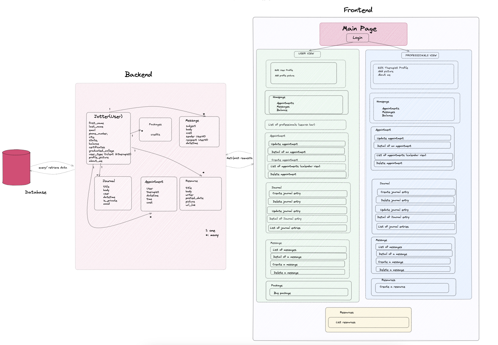

# JOURNAL JOTTER

A platform to create personal diaries and schedule appointments with therapists.
Project is deployed to: https://team-feeling-good.gitlab.io/module3-project-gamma/

## DEVELOPERS

-Melody Oberg
-Esra Ceran
-Daniel Ahdoot
-David Plaskett

##Design
Journal Jotter is a wellness application to stay in touch yourself and professional help in one place. Clients can have access to functionalities of being able to lock or share your diary with your therapist, track your mood, and listen to music on Spotify while journaling. Everyone has access to see blog posts posted by our therapists and a link for hotlines. We provide packages for you to purchase to be able to message and create appointments with therapists. Clients can see their available balance displayed on their homepage. As a therapist user, therapists are able to see their available income, see their client's journals if shared, post/edit/delete resources, and message clients.
This project is was built using FastApi for our backend and React/Redux Tool Kit to build our frontend.

##Wireframe

## How To Run Our Application

Open your docker application and do the following while it starts up:

-Open terminal and git clone: https://gitlab.com/team-feeling-good/module3-project-gamma.
-Change your directory to our project folder by running the command "cd module3-project-gamma"
-In the module3-project-gamma directory, run the following commands one by one: - docker volume create postgres-data - docker volume create pg-admin - docker-compose build - docker-compose up

Open your google chrome browser and type in localhost:3000/ to view our frontend and localhost:8000/docs to see FastAPI backend docs and please wait for the page to load.

## React Routers

Landing Page: http://localhost:3000/

Gives a brief description of Journal Jotter's features.

Signup Page: http://localhost:3000/signup

Sign up as a client or therapist user

Login Page: http://localhost:3000/login

Log into your account.

Home Page: http://localhost:3000/home/

As a client, you'll be able to see list of recent journal entries, upcoming appointments, your current available balance, and a spotify player.
As a therapist, you'll be able to see your client's shared journal entries, upcoming appointments, and your available income.

Profile Page: http://localhost:3000/jotters/

As a client, you'll have a profile page with the ability to have a profile picture, an about me, an email, and a name that is all editable.
As a therapist, you'll have a profile page requiring your first and last name, email, number, location, certificates/college, profile picture, and an about me.

Journal List Page: http://localhost:3000/journals/

As a client you're able to see your most recent entries and mood tracker with a search bar functionality and Spotify player. You can create a journal entry, lock, and delete an entry.
As a therapist, you'll be able to see a list of clients' shared entries.

Messages Page: http://localhost:3000/messages/

As a client, you're able to see a list of recent messages and being able to create a message. It is going to cost you to send a message so you'll be able to see your available balance aftering sending.
As a therapist, you're able to see a list of recent messages and being able to create a message. You are able to see available income.

Appointments Page: http://localhost:3000/appointments/

As a client, you are able to see a list of upcoming appointments. You can create an appointment selecting a dropdown menu of our therapists. It will cost to create an appointment and available balance will be updated. Clients are able to cancel and reschedule appointments.
As a therapist, you can see a list of upcoming appointments, can cancel appointments, and can see available income.

Resources Page: http://localhost:3000/resources/

As an unauthorized user, you are able to see a list of resources created by our therapists and a hotline link.
As a client, you are able to see a list of resources and a list of our therapists.
As a therapist, you are able to see a list of resources and therapists, and can view a resource form, edit, and delete.

Pricing Page: http://localhost:3000/pricing/

As a client, you are able to see a list of packages to select to be able to communicate with therapists and set up appointments.

## FastAPI Endpoints

Account & Authorization

POST /api/accounts/ - Create an account

{
    "first_name": "dave",
    "last_name": "p",
    "email": "dave@dave.com",
    "type": "client",
    "phone_number": "string",
    "city": "string",
    "state": "string",
    "certificates": "string",
    "graduated_college": "string",
    "profile_picture": "string",
    "about_me": "string",
    "password": "string"
}

POST /token - Login & Logout

Enter email and password to login and execute to log out.

GET /token - Get Token

Can execute to get a token after logging in

Journals

DELETE /journals/{journal_id} - Delete A Journal

Enter journal ID and execute

PUT /journals/{journal_id} - Edit A Journal

Enter journal ID and revise body:
{
  "user_id": 0,
  "body": "string",
  "name": "string",
  "date_time": "2023-06-08T08:21:23.498Z",
  "is_private": true,
  "mood": "happy"
}

GET /journals/{journal_id} - Get A Journal's Details

Enter journal id and execute to get details of a specific journal

GET /journals/ - Get All Journals 

Messages

DELETE /messages/{message_id} - Delete A Message

Enter message_id and execute.

PUT /messages/{message_id} - Edit A Message

Enter message id and revise body:
{
  "user_id": 0,
  "recipient": 0,
  "subject": "string",
  "body": "string",
  "cost": 0
}

GET /messages/{message_id} - Get One Message

Enter message id and execute

POST /messages - Create A Message

{
  "user_id": 0,
  "recipient": 0,
  "subject": "string",
  "body": "string",
  "cost": 0
}

GET /messages - Get All Messages

Execute

Resources

DELETE /resources/{resources_id} - Delete A Resource

Enter resource id and execute

PUT /resources/{resource_id} - Edit A Resource

Enter resource id and revise body:
{
  "title": "string",
  "body": "string",
  "writer": 0,
  "picture": "string",
  "url_link": "string"
}

GET /resources/{resource_id} - Get One Resource 

Enter resource id and execute

CREATE /resources - Create A Resource

{
  "title": "tester",
  "body": "testing",
  "writer": 1,
  "picture": "string",
  "url_link": "string"
}

GET /resources/ - Get All Resources

Execute

Jotters

DELETE /jotters/{jotter_id} - Delete A Jotter

Enter journal ID and execute

PUT /jotters/{jotter_id} - Edit A Jotter

Enter jotter ID and revise body:
{
  "first_name": "string",
  "last_name": "string",
  "email": "string",
  "type": "client",
  "phone_number": "string",
  "city": "string",
  "state": "string",
  "certificates": "string",
  "graduated_college": "string",
  "profile_picture": "string",
  "about_me": "string",
  "password": "string"
}

GET /jotters/{jotter_id} - Get A Jotter's Details

Enter jotter id and execute to get details of a specific jotter

GET /jotters/ - Get All jotters 

Execute

CREATE /jotters - Create A Jotter

{
  "first_name": "string",
  "last_name": "string",
  "email": "string",
  "type": "client",
  "phone_number": "string",
  "city": "string",
  "state": "string",
  "certificates": "string",
  "graduated_college": "string",
  "profile_picture": "string",
  "about_me": "string",
  "password": "string"
}

Appointments

DELETE /appointments/{appointment_id} - Delete An Appointment

Enter appointment id and execute

PUT /appointments/{appointment_id} - Edit An Appointment 

Enter appointment id and revise body:
{
  "user_id": 0,
  "therapist_id": 0,
  "appointment_date": "2023-06-08",
  "appointment_time": "string",
  "cost": 0
}

GET /appointments/{appointment_id} - Get One Appointment

Enter appointment id and execute

CREATE /appointments/ - Create An Appointment

{
  "user_id": 0,
  "therapist_id": 0,
  "appointment_date": "2023-06-08",
  "appointment_time": "string",
  "cost": 0
}

GET /appointments/ - Get All Appointments For User

Execute

GET /therapistappointments/{therapist_id} - Get All Appointments for Therapist

Execute

## Directories

Therapy

Our therapy directory holds our backend microservice.

In our migrations folder, we create SQL tables for users, appointments, resources, and messages.

In our queries folder, we handle all CRUD operations for each of our models and connect to our database using "pool.py".

In our routers folder, we organize an endpoint for each operation.

We have an authenticator file to handle authentication in our backend.

GHI

Our GHI directory handles our frontend.

We have a src directory that holds all of our components, stores, and css.

